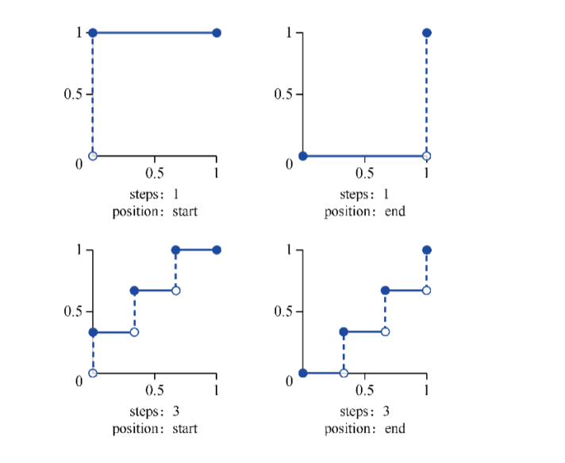

# CSS

## CSS动画

```css
@keyframs fadeIn{
    from{opacity:0;}
    to{opacity:1;}
}
.fade-in{
    animation:fadeIn .25s;
}
```

* `fadeIn`是定义的动画名称
* 在`@keyframs`中规定动画的关键帧
* `animation`是调用自定义动画规则的CSS属性

> 想要实现一个动画,需要**动画名称**,**动画时间**,**animation属性**和**@keyframes**的hi必不可少的

* `animation`是以下属性的简写

| 属性                      | 描述                                                                                                   |
| ------------------------- | ------------------------------------------------------------------------------------------------------ |
| animation-name            | 规定 `@keyframes` 动画的名称.(必须写)                                                                  |
| animation-duration        | 规定动画完成一个周期所花费的秒或毫秒                                                                   |
| animation-timing-function | 规定动画的速度曲线**.默认是`ease`**                                                                    |
| animation-fill-mode       | 规定当动画不播放时(当动画完成时,或当动画有一个延迟未开始播放时),要应用到元素的样式.**默认是backwards** |
| animation-delay           | 规定动画何时开始.**默认是0**.                                                                          |
| animation-iteration-count | 规定动画被播放的次数.**默认是`infinite`**                                                              |
| animation-direction       | 规定动画是否在下一周期逆向地播放**.默认是`normal`**                                                    |
| animation-play-state      | 规定动画是否正在运行或暂停.**默认是`running`**                                                         |

* 动画简写: ```animate:name duration timing-function delay iteration-count direction fill-mode play-state```

### @keyframes

* 接受一个<keyframe-block-list>类型,指的是关键帧列表,每个关键帧由**关键帧选择器**和**对应的CSS样式**组成
  * 关键帧选择器用于指定当前关键帧在在整个动画过程中的位置
  * `from`和`to`两个关键字就代表`0%`和`100%`

1. 关键帧可以不设置

   ```css
   @keyframes fadeIn{
       100% {opacity:1;}
   }
   ```

   * 不设置开始关键帧,那么动画初始状态就是当前元素css值的状态

2. 关键帧的列表可以合并

   ```css
   @keyframes fadeIn{
       0%,50%,100%{
           opacity:0;
       }
       25%,75%{
           opacity:1;
       }
   }
   ```

3. 不同关键帧选择器可以是无序的

   * 虽然动画的执行是顺序的,从0%~100%,但是在代码层面,不同的关键帧都是不分先后的

   ```css
   @keyframes fadeIn{
       /*倒过来写也是一样*/
       100% {opacity:1;}
       0% {opacity:0;}
   }
   ```

4. 重定义的关键帧不会被完全覆盖

   * 重复定义的帧,不同的css样式累加,相同的css样式后面覆盖前面的

   ````css
   @keyframes fadeIn{
       50%{top:30px;left:20px;}
       50%{top:10px;}
   }
   ````

   * 50%这一帧用来动画的css样式是`top:10px;left:20px`

5. `!import`无效

   * 在`@keyframes`无需使用`!import`提高权重,css动画执行的时候,关键帧中定义的css优先级最高

   ```css
   @keyframes fadeIn{
       /*无效的!import*/
       0%{top:30px;left:20px !import;}
       100%{top:10px;}
   }
   ```

   * `@keyframes`规则中的优先级比`style`属性设置的css属性的优先级高为`!import`

### <custom-ident>数据类型

> 动画的名称仅支持<custom-ident>数据类型

* 支持任意字母(a-Z)

* 数字(0~9)

* 下划线和短横线(_,-)

* 转移字符(使用`\`转义后的字符)

* Unicode字符(|后根十六进制的数字)

* 非法性与合法性

  1. css属性本身的关键字不能使用,如unset,none等

  2. 不能以十进制数字开头,如`344fa`

  3. 可以使用短横线开头,但是短横线后不能是十进制

     ```css
     /*合法*/
     -faden
     /*非法*/
     -2333
     ```

  4. 除`-`,和`_`之外的英文标点字符如`.`或者空格都需要转义

     ```css
     /*合法的*/
     example\.png
     ```

  5. 可以使用连续短横线开头.例如`--fadin`

### delay

> 使用`animation-delay`可以达到动画延时与即时播放的效果,和过渡的延时一样

* 如果设置的动画是无限循环,设置的延时只会在第一次起效果,并不会跟着循环继续延时
* `animation-delay`设置负值让动画延时播放:负值会让动画初始立即进入**该时间帧的动画状态**

```html
  <style>
    .loading {
      height: 100%;
      margin-top: 200px;
    }
    .loading i {
      display: inline-block;
      border-left: 20px solid deepskyblue;
      height: 20px;
      animation: scaleUp 4s cubic-bezier(0.22, 0.61, 0.43, 1.02) infinite alternate;
      margin: 0 1px;
    }
    .loading i:nth-child(2) {
      animation-delay: -1s;
    }
    .loading i:nth-child(3) {
      animation-delay: -2s;
    }
    .loading i:nth-child(4) {
      animation-delay: -3s;
    }
    @keyframes scaleUp {
      to {
        transform: scaleY(10);
      }
    }
  </style>
<body>
  <div class="loading">
    <i></i>
    <i></i>
    <i></i>
    <i></i>
  </div>
</body>
```

### direction

> `animation-direction`属性可以用来控制动画的方向,本质上是通过动画的关键帧来实现

* `normal`:初始值
* `reverse`:关键字是让每一轮动画执行的方向相反
* `alternate`:关键字是下一轮动画的执行方向和上一轮动画的执行方向相反
* `alternate-reverse`:动画初始值为100%的css属性,然后下一轮动画的执行方向和上一轮动画的执行方向相反

```css
.element{
    /*fadeIn动画执行的2次*/
    animation:fadeIn 1s 2;
}
@keyframes fadeIn{
    0% {opacity:0;}
    100% {opacity:1;}
}
```

* `animation-direction:normal`,那么动画执行的方向是`0%→100%`,`0%→100%`.并且每一轮的动画方向都是正常的
* `animation-direction:reverse`,那么动画执行的方向是`100%→0%`,`100%→0%`,每一轮的动画方向都是相反

* `animation-direction:alternate`,那么动画执行的方向是`0%→100%`,`100%→0%`,每2n轮的动画方向是相反的.
* `animation-direction:alternate-reverse`,那么动画执行的方向是`100%→0%`,`0%→100%`.每2n+1轮的动画方向是相反的

### iteration-count

* `animation-iteration-count`可以用来指定任意的动画播放次,甚至是小数

```css
.element { 
    animation: fadeIn 1s linear both; 
    animation-iteration-count: 1.5;
} 
@keyframes fadeIn { 
    0% { opacity: 0; } 
    100% { opacity: 1; }
}
```

* 动画播放的进度为0%→100%,0%→50%,也就是在第二轮播放 的时候,播放到一半就会停止,此时元素的透明度是0.5

* 小数值非常有用.可以指定执行动画的关键帧

* `animation-iteration-count: infinite | <number>`

  * 默认值是`1`,动画执行一次结束

  * 可以指定`infinite`,表示动画可以执行无限次
  * 可以指定小数,但是不能指定**负数**

### fill-mode

* `animation-fill-mode`(动画填充模式)用来定义动画执行时间之外的应用的值
* 属性值:`none`(默认值).`forwards`.`backwards`以及`both`
* none是默认值,表示动画开始之前和结束之后不会对元素应用`@keyframes`规则中的任何样式

> `forwards`和`backwards`的含义

* forwards是表示动画结束后(什么时候结束由`animation-iteration-count`决定),**元素应用当前的动画**结束的属性值

  ````css
  .element { 
      opacity: 0.5;
      animation: fadeIn 2s 1s forwards;
  } 
  @keyframes fadeIn { 
      0% { opacity: 0; } 
      100% { opacity: 1; }
  }
  ````

  * 透明度先从0.5突变到0,然后从0过渡到1,保持2s
  * 透明度之后一直会保持1而不是突变到0.5

* backwards是表示动画开始前,**元素应用当前的动画**开始的属性值

* 动画的最后一帧由`animation-iteration-count`和`animation-direction`属性共同决定

| animation-direction        | animation-iteration-count    | 最后一个关键帧 |
| -------------------------- | ---------------------------- | -------------- |
| normal                     | 奇数或偶数(不包括0)          | 100%或to       |
| reverse                    | 奇数或偶数(不包括0) 0%或from |
| alternate                  | 正偶数                       | 0%或from       |
| alternate                  | 奇数                         | 100%或to       |
| alternate-reverse          | 正偶数                       | 100%或to       |
| alternate-reverse          | 奇数                         | 0%或from       |
| normal或alternate          | 0                            | 0%或from       |
| reverse或alternate-reverse | 0                            | 100%或to       |

* backwards只取决于`animation-direction`的属性值,因为backwards只取决于动画第一帧的状态

|     animation-direction      | 第一个关键帧 |
| :--------------------------: | :----------: |
|     normal或者alternate      |   0%(from)   |
| reverse或者alternate-reverse |   100%(to)   |

> `both`:可以让元素的动画在延时等待是保持第一帧的样式,在动画结束后,在动画结束后保持最后一帧的样式,适用于大多数场景

### play-state

>`animation-play-state`属性用于控制css动画的播放和暂停

* 属性值:
  1. `running`:默认是播放状态
  2. `paused`:让一个正在播放的css动画暂停.可以使用js向其中添加,达到控制在动画任意一段的效果

### timing-function

> `animation-timing-function`属性`cubic-bezier()`和`steps()`函数组成的.并且第一个参数和过渡的`cubic-bezier()`是一样这里重点看steps()

* `steps()`函数可以让动画不连续,像楼梯一样
* 语法:`steps(number,position)`
  * `number`是指把动画分成多少段
  * `position`是可选参数,表示动画跳跃执行是在时间段的开始还是结束
    * `start`表示时间段的开头就跳跃
    * `end`(默认值)表示时间段的结束就跳跃

> 理解end和start关键字

* steps()是一个阶跃函数,阶跃函数是一种特殊的连续时间函数,可以实现从0~1的突变
* 一下分别是`steps(1,start)`,`steps(1,end)`,`steps(3,start)`,`steps(3,end)`



* `start`:表示开头直接阶跃,所以开始是没有的,直接执行第二个关键帧
* `end`:表示最后阶段阶跃,但是最后的点是被忽略的,最后的帧是没有的,是开合的
* 例如`left:0`-`ledt:100px`的位移
  * `steps(5,start)`是20px,40px,60px,80px,100px五个时间段表现出来的位移
  * `steps(5,end)`是0px,20px,40px,60px,80px五个时间段表现出来的位移

> 如果`animation-fill-mode`和`steps()`函数一起使用

````css
animation: move 5s forwards steps(5, end);
````

* 由于设置了forwards,动画会一直停留在最后一帧的状态,就是虽然是动画真正表现的是前五段(到80px).其实阶跃的点已经到了100px
* `steps()`函数的简化的关键字
  * `step-start`:是由`steps(1,start)`,表示一步到位
  * `step-end`:是由`steps(1,end)`,表示延时到位

| 值          | 描述                                                  |
| ----------- | ----------------------------------------------------- |
| linear      | 动画从头到尾的速度是相同的.匀速                       |
| ease        | 默认.动画以低速开始,然后加快,在结束前变慢             |
| ease-in     | 动画以低速开始                                        |
| ease-out    | 动画以低速结束                                        |
| ease-in-out | 动画以低速开始和结束                                  |
| steps()     | 指定了时间函数中的间隔数量(步长)                      |
| jump-start  | 动画开始就发生跳跃,和start关键字的表现一样            |
| jump-end    | 动画结束时发生跳跃.和end关键字的表现一样              |
| jump-none   | 动画开始时和结束时都不发生跳跃,然后中国年部分等分跳跃 |
| jump-both   | 动画开始和结束时都发生跳跃                            |
