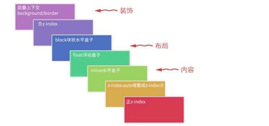
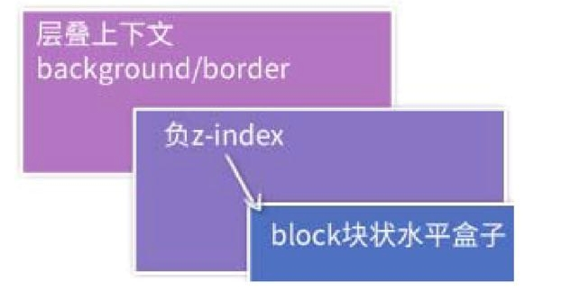

# CSS层叠性

> `z-index`属性并非只对定位元素有效,felx盒子的子元素也可以设置z-index

## 理解层叠上下文

* 层叠上下文(stacking context)是HTML中的三维概念,如果一个元素有层叠上下文,就可以理解这个元素比其他元素更接近人眼
  * z轴就是用户与显示器之间看不见的垂直线
  * 层叠上下文和块状格式化上下文类似,比较抽象

* **层叠水平**决定了同一个层叠上下文中元素z轴上的显示顺序.网页中的每个元素都是独立的个体,他们会有一个类似排名顺序的存在,而这个排名顺序就是层叠水平

>层叠顺序

* `层叠顺序`和上面的`层叠上下`文以及`层叠水平`是不同的概念
* 

1. 最下面的`background/border`特指层叠上下文元素的边框和背景色.每一个层叠顺序规则仅适用于当前层叠上下文元素的小世界
2. inline水平盒子指的是`inline/inline-block/inline-table`元素的层叠顺序,他们都是同等级别的
3. 单纯从层叠水平上看,实际上`z-index:0`和`z-index:auto`可以看成是一样的(实际上两者存在根本性的差异)

>层叠顺序的准则

1. **谁大谁上**:当具有明确的层叠水平标识的时候,如生效的`z-index`属性值,在同一个层叠上下文领域,层叠水平值大的覆盖小的
2. **后来居上**:当元素的层叠水平一致,层叠顺序相同的时候,在DOM中处于后面的元素会覆盖前面的元素

## 深入层叠上下文

>层叠上下文的特性

1. 层叠上下文水平要比普通元素高
2. 层叠上下文可以阻断元素的混合模式
3. 层叠上下文可以嵌套,内部层叠上下文及其所有子元素均受制于外部的**层叠上下文**
4. 每个层叠上下文和兄弟元素独立,当进行层叠上下文或者渲染的时候,只需要考虑后代元素
5. 每个层叠上下文都是自成体系的,当元素发生层叠的时候,整个元素被认为是在父层叠上下文的层叠顺序中

>层叠上下文的创建

1. `天生派`:页面根元素天生具有层叠上下文,称为根层叠上下文
2. `正统派`:z-index值为数值的定位元素的传统`层叠上下文`
3. `扩招派`:其他的CSS3属性

* 根层叠上下文:可以看成是\<html>元素,页面中的元素一定至少处于一个层叠结界中
* 定位元素和传统的层叠上下文
  1. 对于`position:absolute/relative`或者`position:fixed`,当z-index值不为auto的时候,会创建层叠上下文
  2. 如果是`z-index:auto`所在的元素,是普通定位元素,里面的元素不会受父级影响,遵循**谁大谁上**的准则
  3. 如果是`z-index:0`所在的元素会创建层级上下文,里面的元素会受到父元素的影响,表现为**后来居上**

>自动创建层叠上下文的元素

* position:relative或position:absolute定位元素的z-index值不为auto
* position:fixed固定定位元素
* flex子项的z-index值不为auto
* 元素的opacity属性值不是1
* 元素的clip-path属性值不是none
* 元素的transform属性值不是none
* 元素的mix-blend-mode属性值不是normal
* 元素的filter属性值不是none
* 元素的contain属性值不是none
* will-change指定的属性值为opacity,clip-path,transform,mix-blend-mode,filter和contain中的任意一个
* 元素的-webkit-overflow-scrolling设为touch

## 层叠上下文和层叠顺序

1. 如果层叠上下文元素不依赖z-index数值,则其层叠顺序是`z-index:auto`,可以看成是`z-index:0`级别的
2. 如果层叠上下文依赖z-index数值,则其层叠顺序由z-index决定.

* 元素一旦成为定位元素,其`z-index`就会自动生效,此时其z-index就是默认的auto,也就是0级别的

>z-index负值深入理解

* z-index虽然是负值元素,但是层级任然是在层叠上下文元素上面,block元素的下面
* 也就是说z-index虽然名为负数层级,但依然无法突破当前的层叠上下文
* 

```html
<style>
  .box{
    background-color:blue;
  }

  .box > img{
    position: relative;
    z-index: -1;
    right: -50px;
  }
</style>
<div class="box">
  
</div>
```

* 由于图片是z-index负值元素,会被蓝色的block元素挡住
* 给.box设置层叠上下文.这时候蓝色的盒子就会隐藏到层叠上下文的后面

   ```css
   .box{
     background-color: blue;
     transform: scale(1);
   }
   ```

* **z-index负值**.可访问隐藏元素,只需要层叠上下文内的某一个父元素加个背景色就可以使元素隐藏

>设置z-index准则.一般需要设置z-index不要超过二

1. 定位元素一旦设置了z-index值,就从普通定位元素变成了层叠上下文元素,相互间的层叠顺序就发生了变化,很容易产生巨大的z-index值也无法覆盖其他元素的问题
2. z-index的样式混乱,如果DOM元素的顺序确实无法调整,不得不使用z-index也不能超过3
