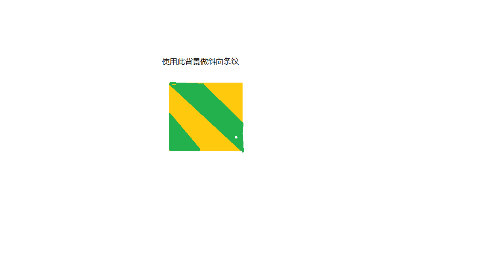
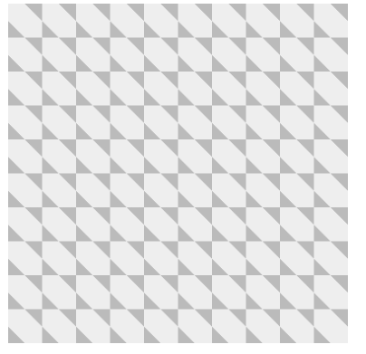
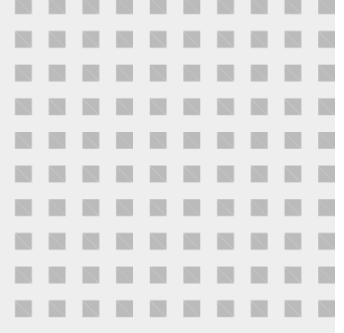

## 背景与边框

### [半透明框](01半透明边框.html)

> rgba和hsla

* `rgba(0, 0, 0, 0.5)`
  * 前三个参数对应红绿蓝三个参数,0(纯黑)-255(纯白)
  * 第四个参数`alpha`(透明度),是0(完全透明)-1(完全不透明)
* `hsla(H,S,L,A)`
  * H:**Hue(色调)**.0(或360)表示红色,120表示绿色,240表示蓝色,也可取其他数值来指定颜色.取值为:0 - 360
  * S:**Saturation(饱和度)**.取值为:`0.0% - 100.0%`
  * L:**Lightness(亮度)**.取值为:`0.0% - 100.0%`
  * A:**Alpha透明度**.取值0~1之间.
* `background-clip`:控制背景颜色的显示范围
  * **border-box**:背景延伸到边框的外边缘(但在 z 排序中的边框下方).
  * **padding-box**:背景延伸到填充的外边缘.边框下方不绘制背景.
  * **content-box**:背景绘制在(剪辑到)内容框内.
  * **text**:背景绘制在(剪切到)前景文本内.
* `background-attachment`
  * **fixed**:背景图片相对于视口(`viewport`)固定,直到当前整个视口划走才会滚动.
  * **scroll**:默认值.背景图片相对于元素固定.也就是当元素内容滚动时背景图像不会跟着滚动,因为背景图像总是要跟着元素本身.但是会随祖先元素或者窗体一起滚动
  * **local**:背景图像相对于元素固定,也就是说岁元素滚动时背景图像也会跟着滚动,因为背景图像总是要跟着内容
* `background-size`:用于设置图片的大小.图片可以保有原有的尺寸,或者拉伸到新的尺寸,或者在保持器原有的比例的同时缩放到元素的可用空间的尺寸
  * **<length>**,指定背景图片大小,不能为负值
  * **<percentage>**,指定被禁图片相对背景去的百分比
  * **关键字**:
     1. `auto`:以背景图片的比例缩放背景图片
     2. `cover`:缩放背景图片完全覆盖背景区,可能是背景图片看不见.给背景图以他的全部宽或者高覆盖所在容器.当容器何背景图大小不同时,背景图的上下左右可能会被裁剪
     3. `contain`:缩放图片以完全装入背景区,背景区部分可能流部分空白.和 contain 值相反,cover 值尽可能大的缩放背景图像并保持图像的宽高比例(图像不会被压扁)
  > 属性值

  * 一个属性值:
     1. 关键字:就是关键字原生的意思
     2. 一个值:这个值指定图片的宽度,图片的高度隐式的为auto

   ```css
  background-size:auto;
  background-size:3rem;
   ```
  
  * 两个值:一个值为图片的宽度,另一个值为图片的高度

  ```css
  background-size:auto auto;
  background-size:50% auto;
  ```
  
  * 逗号分割多个值,设置多重背景.(使用`background`缩写也是可以)

  ```css
  background-size: auto, auto;     /* 不同于background-size: auto auto */
  background-size: 50%, 25%, 25%;
  ```

### 多重边框

#### 使用box-shadow

> 了解**box-shadow**(只能模拟实线)

* `box-shadow:0 0 0 10px rgb(43, 50, 58)`
  * 第一和第二个参数分别是对于x和y的偏移量,相对于top和left
    * 正数往右下偏移
    * 负数往左上偏移
  * 第三个参数`blur-radius`(模糊半径)
    * 不允许使用负值
    * 未指定默认为0
    * 值越大,模糊越大,阴影变得越大越亮
  * 第四个参数`spread-radius`(扩张半径)
    * 未指定默认为0
    * 正值将阴影扩大变大
    * 负值会导致阴影缩小
  * 第五个参数`color`:阴影的颜色
  * 第六个参数,阴影的位置
    * outset:默认是外部阴影
    * inset:将外部阴影改成内部阴影

* <span style="color:red">注意:</span>
   1. 默认的是外阴影(ouset),但是不可以写这个单词,否则导致阴影无效
   2. 盒子阴影不占用空间,不会影响其他盒子排列

> 多重边框的设定

```css
div{
  ...
  box-shadow: 0 0 0 10px rgb(43, 50, 58),
  0 0px 0px 20px rgb(86, 124, 119);
}
```

* 注意:
  * 此边框并不会响应鼠标事件,如悬停或者点击
  * 可以给`box-shadow`属性加上`inset`关键字,使投影绘制在元素内圈

#### 使用outline

> 了解**outline**(实现虚线都可以模拟)

* **outline**是下面三个属性的简写
  * `outline-color`:边框的颜色
  * `outline-style`:边框的样式,例如`solid`
  * `outline-width`:边框的粗细

* **outline-offset**:边框的偏移量
  * 正数:向盒子外方向偏移
  * 负数:向盒子内方向偏移

```css
.outline {
  width: 20rem;
  height: 10rem;
  background-color: rgba(177, 115, 115, 0.4);
  outline: rgba(189, 32, 32, 0.4) dashed 2px;
  outline-offset: -14px;
}
```

* 注意:
  * 并不适用多层边框的情况:使用多层边框可以直接使用`box-shadow`
  * 边框贴合`border-radius`(圆角边框)

### 背景定位

#### background-position

> 可以指定背景图片距离任意角的偏移量,只要在偏移量前指定关键词

1. **一个值**:
   1. **可以设置关键词**.<span style="color:red">用于将背景放在哪一个边缘.那么另一个值被设置成50%</span>`center`:居中`top`:考上`left`:靠左`bottom`:靠下`right`:靠右
   2. **设置偏移量**:当只有一个偏移量时.会以y轴居中的方向作为参考系的原点
2. **两个值**:一个定义x坐标,另一个定义y坐标
   1. **当两个值都是关键字时**.`left和right`,`top和bottom`不能同时出现
   2. **只有`x,y`偏移量的时候**.坐标原点以左上角开始
   3. **在偏移量前指定关键词**.会以偏移量所指定的关键词位置作为原点.例如:`right 0% bottom 0%;以右下角作为原点`

* **`background-position`属性被指定一个或多个<位置>(多组偏移量)值,用逗号隔开**

```css
.bp {
  width: 20rem;
  height: 20rem;
  background: url("./code-pirate.svg") no-repeat #58a;
  background-position: right 100px bottom 100px;
}
```

* 注意:`background-position`默认以`padding-box`为准的定位

#### background-origin

> 设置定位的标准(当使用 `background-attachment` 为`fixed`时,该属性将被忽略不起作用)

* `border-box`:背景相对于(border)边框定位.
* `padding-box`:默认值.背景相对于(padding)填充框定位.
* `content-box`:背景相对于(content)内容框定位.

#### background-repeat

> 该属性设置石头及如何重复背景图像,默认会在水平和垂直方向上重复
>
>从原图像开始重复,原图像由 `background-image`定义,并根据 `background-position`的值放置

| 值        | 描述                                     |
| --------- | ---------------------------------------- |
| repeat    | 默认.背景图像将在垂直方向和水平方向重复. |
| repeat-x  | 背景图像将在水平方向重复.                |
| repeat-y  | 背景图像将在垂直方向重复.                |
| no-repeat | 背景图像将仅显示一次.                    |

### 边框内圆角

> 使用`border-shadow`属性

```html
<style>
  .meaningful {
    background: #655;
    padding: 0.8em;
  }
  .meaningful>div {
    background-color: tan;
    border-radius: 0.8em;
    padding: 1em;
  }
</style>
<body>
  <div class="meaningful">
    <div>
      一起去吃席好吗
    </div>
  </div>
</body>
```

### 条纹背景

#### 了解linear-gradient()

1. 只传入渐变颜色,默认从水平方向渐变,且渐变线出现在默认总高度的60%
   * 例:`llinear-gradient(#fb3 50%, #58a 50%);`
   * 可以传入一个百分比:表示从哪里开始渐变
   * 都是50%相当于平分盒子且没有渐变
2. 第一个参数可以传入一个渐变角度或者渐变名词
   * **注意**:包含1的参数写法<span style="color:red">渐变角的度数是左下水平线与渐变线的角度</span>.`-45deg=135deg`
   * **渐变轴为45度,从蓝色渐变到红色**
     * `linear-gradient(45deg, blue, red);`
   * **从右下到左上、从蓝色渐变到红色**
     * `linear-gradient(to left top, blue, red);`
3. 多个参数
   * `linear-gradient(0deg, blue, green 40%, red);`
     * 从下到上,从蓝色开始渐变、到高度40%位置是绿色渐变开始、最后以红色结束

>* <span style="color:red">过渡的起止分色分别是第一个和最后一个指定值.且颜色不会在某个位置突然变化,而是一个平滑渐变的过程</span>
>* 渐变的一个规律:**渐变的值一定要依次递增才会有渐变的效果,依次递减也不可以**

* 以这个为例:
  * 正确`linear-gradient(0deg, blue, green 40%, red);`
  1. 错误`linear-gradient(0deg, blue 40%, green 40%, red 40%);`
  2. 错误`linear-gradient(0deg, blue 60%, green 40%, red 30%);`
  
#### 重复条纹

> 由于背景在默认情况下是**重复平铺**,整个容器已经被填满了水平条纹

* 设置一个背景的大小,是他重复布满整个背景
  * 例:`background-size:100% 20px`

#### 垂直条纹

> 使用方位名词:`to right`或者角度:`90deg`

#### 斜向条纹

>斜向条纹只有下图贴片可以排列



```css
.bg {
  width: 100px;
  height: 100px;
  background: linear-gradient(45deg, 
  #305866 25%, #406a5e 25%, 
  #406a5e 50%, #305866 50%, 
  #305866 75%, #406a5e 75%);
  background-size: 20px 20px;
}
```

> 使用`repeating-linear-gradient`来减少重复,替代`background-size`

* 此属性可以无限循环,一个渐变图案可以自动重复并铺满整个页面

```css
.bg {
  width: 100px;
  height: 100px;
  background: repeating-linear-gradient(45deg, 
  #305866 0, #305866 10px, 
  #406a5e 10px, #406a5e 20px);
}
```

#### radial-gradient()

* `radial-gradient()`和`repeating-radial-gradient()`

> 形状可以是圆形(circle)或椭圆形(ellipse)

* 与`linear-gradient()`属性不同的是第一个参数,其它可以参考

| 属性              | 描述                                                                                                            |
| ----------------- | --------------------------------------------------------------------------------------------------------------- |
| `closest-side`    | 渐变的边缘形状与容器距离渐变中心点最近的一边相切（圆形）或者至少与距离渐变中心点最近的垂直和水平边相切（椭圆）. |
| `closest-corner`  | 渐变的边缘形状与容器距离渐变中心点最近的一个角相交.                                                             |
| `farthest-side`   | 与closest-side相反,边缘形状与容器距离渐变中心点最远的一边相切（或最远的垂直和水平边）.                          |
| `farthest-corner` | 渐变的边缘形状与容器距离渐变中心点最远的一个角相交.                                                             |

* 注意:至少传入两个有关颜色参数

> 参考:<https://developer.mozilla.org/zh-CN/docs/Web/CSS/gradient/radial-gradient()>

#### 网格背景

>网格背景主要是`横向`(`linear-gradient(#fffffffa 1px, #390f0f00 1px)`)和`纵向`(`linear-gradient(90deg, white 1px, #9b121200 1px)`)的分割背景,使背景达到网格效果

```css
.bg {
  height: 100px;
  width: 100px;
  background-color: #58a;
  background-image: linear-gradient(#fffffffa 1px, #390f0f00 1px), linear-gradient(90deg, white 1px, #9b121200 1px);
  background-size: 10px 10px;
}
```

* 横向渐变与纵向渐变的利用,形成网格图形(指定的参数不会形成渐变效果)

#### 波点

```css
.bg {
  width: 100px;
  height: 100px;
  background-color: rgba(22, 37, 44, 0.582);
  background-image: radial-gradient(tan 30%, transparent 30%);
  background-size: 10px 10px;
}
```

* 注意:第二个参数是任意的颜色,但是渐近线的选择一定要小于第一个才能没有渐进效果

#### 棋盘

>简单的想法就是依靠两个等腰直角三角形去拼接成为一个方格

```css
.bg {
  height: 300px;
  width: 300px;
  background: #eee;
  background-image: linear-gradient(45deg, transparent 50%, #bbb 50%);
  background-size: 30px 30px;
}
```

* 问题是如果拼接后,整个面板都会是同一种颜色,所以不能设计成50%渐变应该由`25%或者75%`
  1. 由于是两个等要三角形拼接成方格,所以渐变开始的颜色是颠倒的
  2. 不仅开始的颜色颠倒,渐变**结束和开始**的位置也是不同的

```css
.bg {
  height: 300px;
  width: 300px;
  background: #eee;
  background-image: linear-gradient(45deg, transparent 75%, #bbb 75%),
    linear-gradient(45deg, #bbb 25%, transparent 25%);
  background-size: 30px 30px;
}
```

>这样就可以得到两个等腰直角三角形



>**不过这并不是我们想要的,我们需要把第二层渐变在水平和垂直方向均移动贴片长度的一半**

```css
.bg {
    height: 300px;
    width: 300px;
    background: #eee;
    background-image: linear-gradient(45deg, transparent 75%, #bbb 75%), 
    linear-gradient(45deg, #bbb 25%, transparent 25%);
    background-size: 30px 30px;
    /* 第一层渐变不变,设置第二层渐变移动 */
    background-position: 0px 0px,15px 15px;
}
```



* 得到方格之后.并不是棋盘的格式.不过只要只要再重复一次渐变的位置就可以了
* <span style="color:red">不管渐变的属性有多少,都会按顺序执行`background-position`的位置属性</span>.如果渐变的属性大于位置的个数,那么到达峰值后会从头来执行.(**所以顺序很重要不能乱**)

```css
.bg {
  height: 300px;
  width: 300px;
  background: #eee;
  background-image: linear-gradient(45deg, transparent 75%, #bbb 75%),
    linear-gradient(45deg, transparent 75%, #bbb 75%),
    linear-gradient(45deg, #bbb 25%, transparent 25%),
    linear-gradient(45deg, #bbb 25%, transparent 25%);
  background-size: 30px 30px;
  background-position: 0px 0px, 15px 15px;
}
/* 也可以写成两层渐变 */
background-image: linear-gradient(45deg, #bbb 25%, transparent 25%, transparent 75%, #bbb 75%, transparent 200%),
  linear-gradient(45deg, #bbb 25%, transparent 25%, transparent 75%, #bbb 75%, transparent 200%);
```

### [伪随机背景图](09伪随机背景.html)

>**蝉原则**:以质数作为循环周期来增加`自然随机性`的策略

* 很容易就能写出一个伪随机背景图的案例

```css
.bg {
  height: 200px;
  width: 200px;
  border-radius: 100px;
  box-shadow: 0 0 0 10px rgb(125 177 183);
  background-color: #026873;
  background-image: linear-gradient(90deg, rgba(225, 225, 225, 0.055) 50%, transparent 50%),
    linear-gradient(90deg, rgba(225, 225, 225, 0.151) 50%, transparent 50%),
    linear-gradient(90deg, rgba(225, 225, 225, 0.274) 50%, transparent 50%),
    linear-gradient(90deg, rgba(225, 225, 225, 0.329) 50%, transparent 50%);
  background-size: 13px, 15px, 17px, 19px;
}
```

### [连续的图像边框](https://www.w3schools.com/cssref/css3_pr_border-image-slice.asp)

>* border-image属性允许您指定要使用的图像,而不是元素周围的正常边框
>* `border-image: source slice width outset repeat|initial|inherit`

1. 用作边框的图像
2. 在哪里切片图像
3. 定义中间部分是否应重复或拉伸

* **注意**:<span style="color:red">要border-image工作,元素还需要 border属性集</span>

>* **border-image**:是以下属性的简写.  

1. **border-image-source**:要用作边框的图像的路径
   * 属性值为`url`
2. **border-image-slice**:属性指定如何对由`border-image-source`指定的图像进行切片.<span style="color:red">图像总是被分成九个部分:四个角、四个边缘和中间</span>.一般采用一到四个值.
   * **默认值是100%**,相当于没有裁剪.他会将裁剪线移到各个边缘,会形成四个一模一样的图形
   * 
   * `border-image-slice: number | % && fill|initial|inherit;`
   * `number`:代表光栅图像的像素或矢量图像的坐标(没有单位,专指像素)
   * `%`:百分比是相对于图像的高度或宽度(百分比越小拉伸越夸张)
   * `fill`:有fill就会显示图片的中间部分.默认情况下是不会显示的
   * 例如`border-image-slice:20`.会在举例源图像上方,右侧,下方,左侧的地方进行划分,其中4个边角区域只会有很小的一部分被拉伸,剩余的上下左右会被拉伸
3. **border-image-width**:一般采用一到四个值(top,left,bottom,right).如果省略,和padding相同
   * `border-image-source`如果是渐变图像,则渐变图像的尺寸是暗元素的`border-box`计算的
   * `border-image-width: number|%|auto|initial|inherit;`
   * `length|number|%`:**数值没有单位**,表示是初始的倍数,会与`border-width`的的值相乘.**数值有单位**(例如px)表示长度.**数值是%**,表示指边框图像区域的大小:水平相对于自身的宽度,垂直相对于自身的高度
4. **border-image-outset**:属性指定边框图像区域超出边框框的量
   * `border-image-outset: length(长度)|number(倍数)|initial|inherit;`
5. **border-image-repeat**:属性指定边框图像是否应重复、圆角、间隔或拉伸
   * `border-image-repeat: stretch|repeat|round|space|initial|inherit;`
   * `stretch`:**默认值**.图像被拉伸以填充该区域
   * `repeat`:图像被平铺(重复)以填充该区域
   * `round`:图像被平铺(重复)以填充该区域.如果它没有用完整数量的图块填充该区域,则重新缩放图像以使其适合
   * `space`:图像被平铺(重复)以填充该区域.如果它没有用完整数量的瓷砖填充该区域,则额外的空间将分布在瓷砖周围

> 形式化语法

```css
<'border-image-source'> || <'border-image-slice'> [ / <'border-image-width'> | / <'border-image-width'>? / <'border-image-outset'> ]? || <'border-image-repeat'>
```

* `border-image:54 // 20px;`是slice:54,outset:20px的简写.`<'border-image-width'>?`由于有?可以省略,但是`/`没有,所以不能省略

>信封为例

1. boeder的宽度是一定要有,这是决定`border-image`展开大小的前提

```css
.bg {
  height: 20rem;
  width: 20rem;
  padding: 1rem;
  border: 1rem solid;
  border-image: repeating-linear-gradient(-225deg, red 0, red 1rem,
      green 1rem, green 2rem,
      blue 2rem, blue 3rem, green 3rem, green 4rem);
  border-image-slice:16;
   
}
```

>* 操控`border-image-slice`的值也能发现,这个属性更偏向于裁剪,裁剪完之后,在重新安置图片.依靠`border-image-repeat`属性达到不同的效果
>* <span style="color:red">不管是百分比还是像素,值越大越向两边拉伸,值越小越像中间区域拉伸,直到达到临界值</span>

* 注意: 由于`border-radius`无法改变`border-image`属性生成的图形效果.建议使用`clip-path`来裁剪
